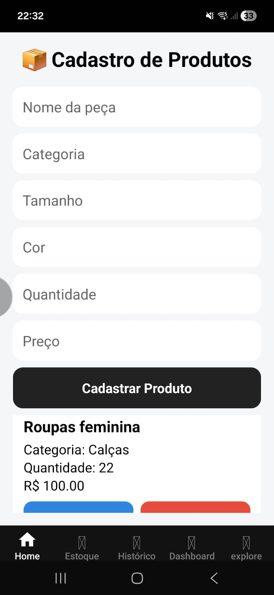
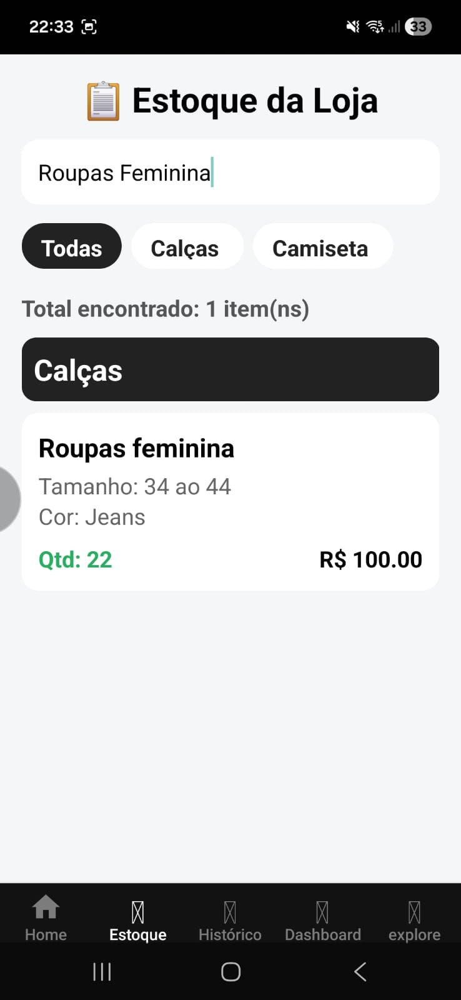
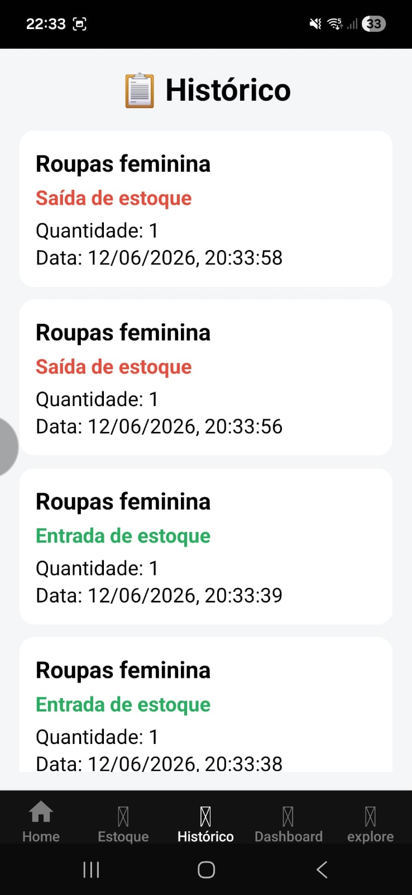
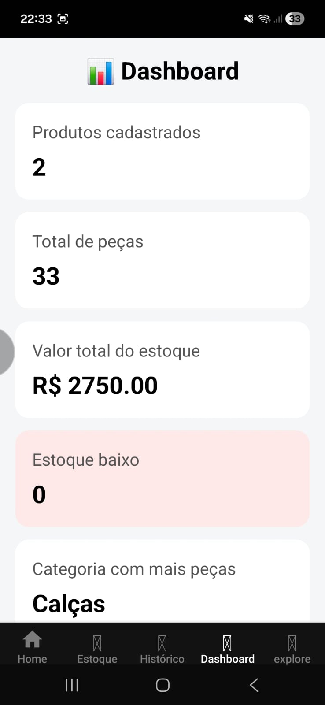

#  Estoque Roupas App

Aplicativo mobile desenvolvido para gerenciamento de estoque de loja de roupas, utilizando React Native, Expo, TypeScript e SQLite.

##  Funcionalidades

- Cadastro de produtos
- Edição de produtos
- Exclusão de produtos
- Controle de entrada de estoque
- Controle de saída de estoque
- Histórico de movimentações
- Dashboard gerencial
- Persistência local com SQLite

##  Tecnologias Utilizadas

- React Native
- Expo
- TypeScript
- SQLite
- Expo Router

##  Screenshots

### Cadastro de Produtos

### Estoque

### Histórico

### Dashboard

##  Objetivo do Projeto

Este projeto foi desenvolvido para praticar desenvolvimento mobile e criar uma solução real para controle de estoque de uma loja de roupas.

##  Autor

### Guilherme Bomfim Ribeiro

Estudante de Análise e Desenvolvimento de Sistemas.

- GitHub: https://github.com/GuiH666
- LinkedIn: https://www.linkedin.com/in/guilherme-bomfim-ribeiro-2623aa218/

##  Licença

Projeto desenvolvido para fins de estudo e portfólio.