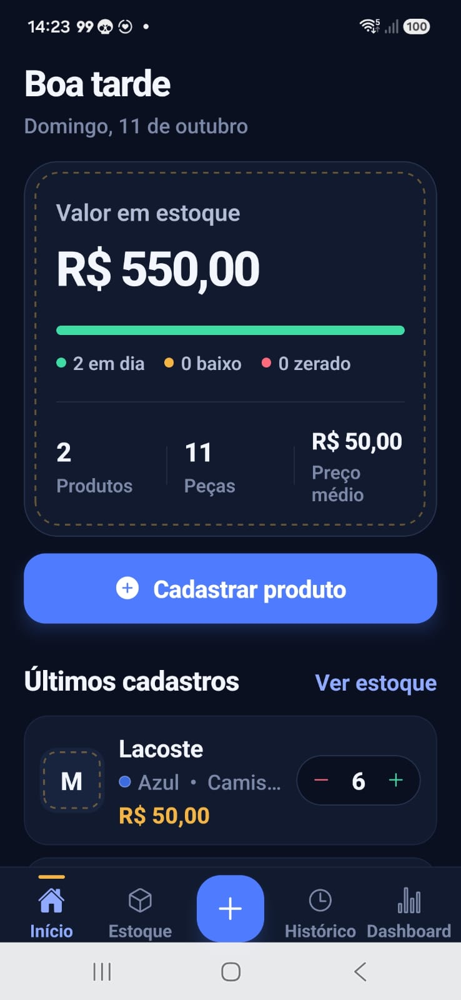

# Estoque Roupas App

Aplicativo mobile para controle de estoque de uma loja de roupas, feito com React Native, Expo, TypeScript e SQLite. Funciona sem internet: os dados ficam guardados no próprio aparelho.

## Telas

<table align="center">
  <tr>
    <td align="center"><b>Início</b><br /><br /></td>
    <td align="center"><b>Cadastro de produto</b><br /><br /></td>
    <td align="center"><b>Estoque</b><br /><br /></td>
  </tr>
  <tr>
    <td align="center"><b>Histórico</b><br /><br /></td>
    <td align="center"><b>Dashboard</b><br /><br /></td>
    <td></td>
  </tr>
</table>

## Funcionalidades

- **Início:** valor total em estoque, saúde do estoque (em dia, baixo e zerado), aviso de reposição, últimos cadastros e movimentações recentes.
- **Cadastro de produto:** etiqueta de prévia que se preenche enquanto você digita. Categoria, tamanho e cor escolhidos por botões, quantidade com + e −, preço com máscara em reais e a opção "Cadastrar e adicionar outro".
- **Estoque:** busca por nome, cor ou tamanho, filtro de estoque baixo, filtro por categoria e botões de +1 e −1 em cada produto.
- **Histórico:** entradas e saídas agrupadas por dia, com filtro.
- **Dashboard:** entradas e saídas dos últimos 7 dias, peças por categoria, maiores estoques por peças ou por valor e produtos que precisam de reposição.
- Cadastro, edição e exclusão de produtos, com dados salvos localmente em SQLite.

## Tecnologias

- [Expo](https://expo.dev) e React Native
- [Expo Router](https://docs.expo.dev/router/introduction/) para a navegação
- [expo-sqlite](https://docs.expo.dev/versions/latest/sdk/sqlite/) para o banco de dados local
- TypeScript

## Como rodar

```bash
npm install
npx expo start
```

Depois, escaneie o QR code com o app Expo Go no celular.

## Como gerar o APK

```bash
eas build --platform android --profile preview
```

## Estrutura

```
app/                telas e navegação (Expo Router)
  (tabs)/           Início, Estoque, Histórico e Dashboard
  produto.tsx       cadastro e edição de produto
src/
  components/       componentes visuais (cartão de produto, barra de abas, etiqueta)
  database/         criação das tabelas e consultas SQLite
  services/         regras de negócio (produtos e movimentações)
  theme/            cores e medidas do visual
  types/            tipos do TypeScript
  utils/            formatação, cores e funções de apoio
screenshots/        imagens usadas neste README
```

## Objetivo do projeto

Este projeto foi desenvolvido para praticar desenvolvimento mobile e criar uma solução real para controle de estoque de uma loja de roupas.

## Autor

**Guilherme Bomfim Ribeiro**
Estudante de Análise e Desenvolvimento de Sistemas

[GitHub](https://github.com/GuiH666)
